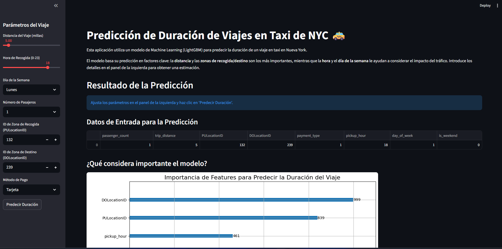
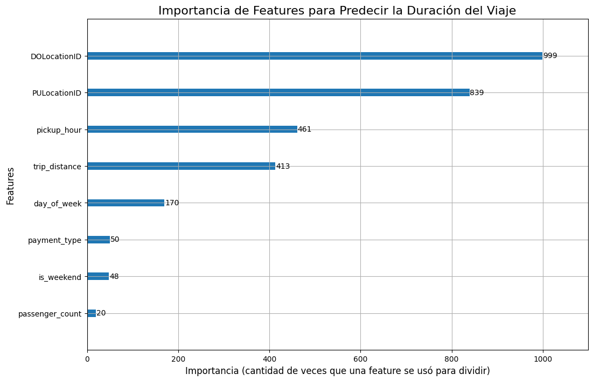

# 🚖 NYC Taxi: Pipeline de Machine Learning con Polars y Streamlit

Este proyecto implementa un pipeline completo de Machine Learning para predecir la duración de los viajes en taxi de Nueva York. Utiliza **Polars** para el procesamiento de datos de alto rendimiento y **Streamlit** para crear un dashboard interactivo que permite explorar el modelo en tiempo real.

El flujo de trabajo abarca desde el Análisis Exploratorio de Datos (EDA) y la Ingeniería de Características hasta el entrenamiento de un modelo predictivo (LightGBM) y su despliegue en una aplicación web.

## 📊 Dashboard Interactivo

La aplicación final permite a los usuarios introducir los parámetros de un viaje y obtener una predicción instantánea de la duración, además de visualizar los factores más importantes para el modelo.




## 🎯 Resultados del Modelo Predictivo

El objetivo fue predecir la `trip_duration` (duración del viaje). Se entrenó un modelo `LGBMRegressor` que logró un rendimiento sólido en el conjunto de prueba.

* **Métrica de Evaluación:** Root Mean Squared Error (RMSE)
* **Resultado:** **4.49 minutos** (Ejemplo, reemplaza con tu valor)

Esto significa que, en promedio, las predicciones del modelo tienen un error de solo ~4.5 minutos, un resultado muy bueno considerando la alta variabilidad del tráfico en Nueva York.

### Importancia de Features

El análisis del modelo revela qué factores son los más influyentes para realizar una predicción:



## ⚡ Ventaja de Rendimiento con Polars

Todo el preprocesamiento de datos y la ingeniería de características se realizaron con **Polars**. Esta elección fue clave para manejar eficientemente el dataset de millones de filas, permitiendo una iteración y experimentación mucho más rápidas en comparación con Pandas.

## 🛠️ Tecnologías Utilizadas

* **Análisis y Procesamiento:** Polars, Pandas
* **Machine Learning:** Scikit-learn, LightGBM
* **Visualización:** Matplotlib, Seaborn
* **Dashboard y Despliegue:** Streamlit, Streamlit Cloud
* **Manejo de Modelos:** Joblib

## 📂 Estructura del Proyecto

La estructura final del proyecto está organizada para separar la lógica de la presentación:

```bash
📦 taxi-polars-vs-pandas
 ┣ 📁 data/                   # Dataset parquet (NYC Taxi)
 ┣ 📁 notebooks/              # Notebooks de exploración y prototipos
 ┣ 📁 src/                    # Código fuente organizado en módulos
 ┃ ┣ 📄 eda.py                # Exploratory Data Analysis
 ┃ ┣ 📄 preprocessing.py      # Limpieza y feature engineering
 ┃ ┣ 📄 training_pipeline.py  # Entrenamiento del modelo
 ┃ ┣ 📄 inference_pipeline.py # Inferencia y predicciones
 ┃ ┗ 📄 benchmarking.py       # Comparación Pandas vs Polars
 ┣ 📁 dashboard/              # Código para el dashboard en Streamlit
 ┣ 📄 requirements.txt        # Dependencias del proyecto
 ┗ 📄 README.md               # Documentación de este proyecto
```

---

## ⚡ Benchmarking Pandas vs Polars

Ejemplo de comparación (lectura + limpieza de 1M registros):

| Librería | Tiempo (s) | Memoria (MB) |
| -------- | ---------- | ------------ |
| Pandas   | 12.5       | 480          |
| Polars   | 4.2        | 210          |

✅ Polars mostró ser **3x más rápido** y **2x más eficiente en memoria**.

---

## 🛠️ Tecnologías utilizadas

* **Python** 🐍
* **Pandas** y **Polars**
* **Scikit-learn** para el modelado predictivo
* **Matplotlib / Seaborn / Plotly** para visualización
* **Streamlit** para el dashboard
* **Docker** (opcional para despliegue reproducible)

---


## 🚀 Cómo Ejecutarlo Localmente

1.  **Clonar el repositorio:**
    ```bash
    git clone https://github.com/Parzival099/Intership
    cd Intership
    ```

2.  **Crear un entorno virtual e instalar dependencias:**
    ```bash
    python -m venv venv
    # Activar el entorno (Windows)
    venv\Scripts\activate
    # Activar el entorno (Linux/Mac)
    source venv/bin/activate
    
    pip install -r requirements.txt
    ```

3.  **Entrenar el modelo (solo la primera vez):**
    Asegúrate de tener el dataset en la carpeta `data/`. Luego, ejecuta el pipeline de entrenamiento para generar el archivo del modelo.
    ```bash
    python src/training_pipeline.py
    ```

4.  **Ejecutar el dashboard:**
    ```bash
    streamlit run dashboard/app.py
    ```
## ☁️ Despliegue en la nube

El proyecto puede ser desplegado en:

* 🌐 **Streamlit Cloud** → simple y rápido.
* 🤗 **Hugging Face Spaces** → ideal para modelos ML.
* 🚀 **Render / Railway** → despliegue backend + frontend.

---
